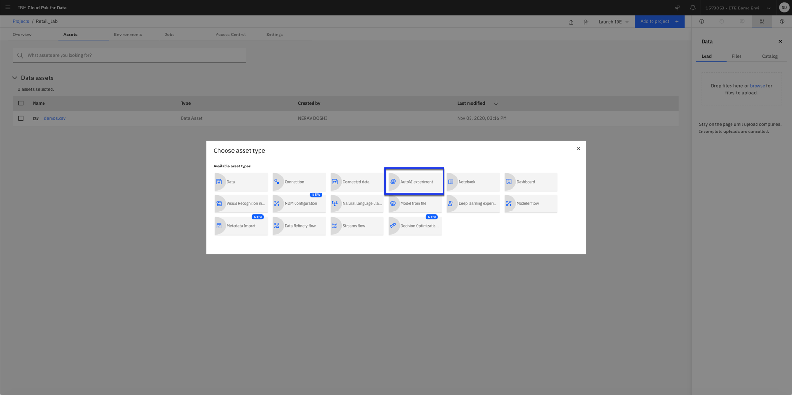
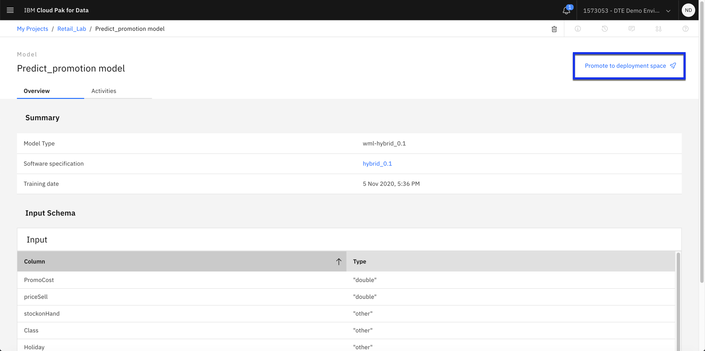
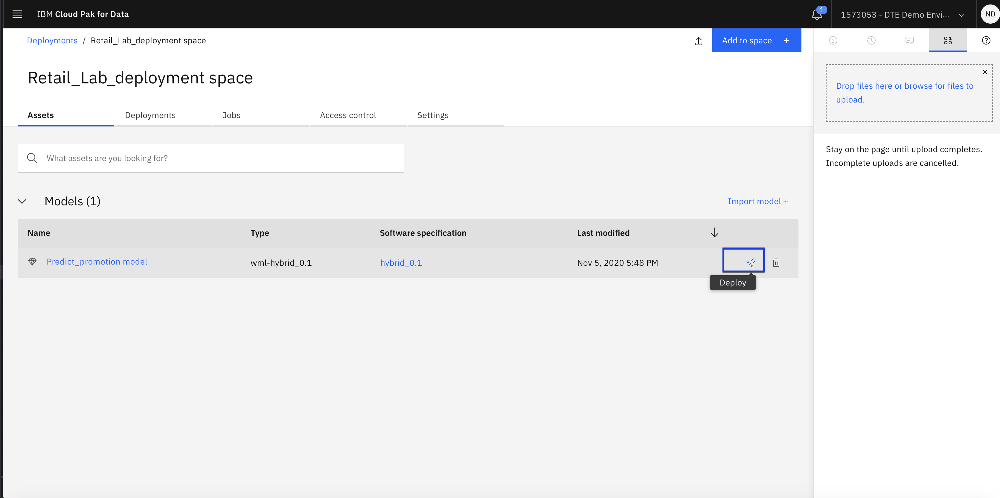
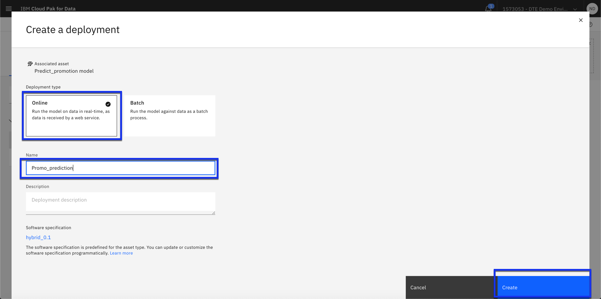
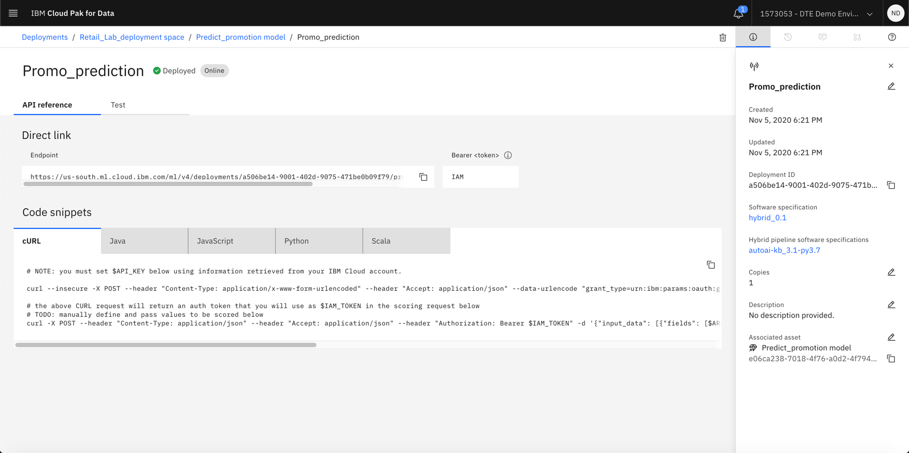
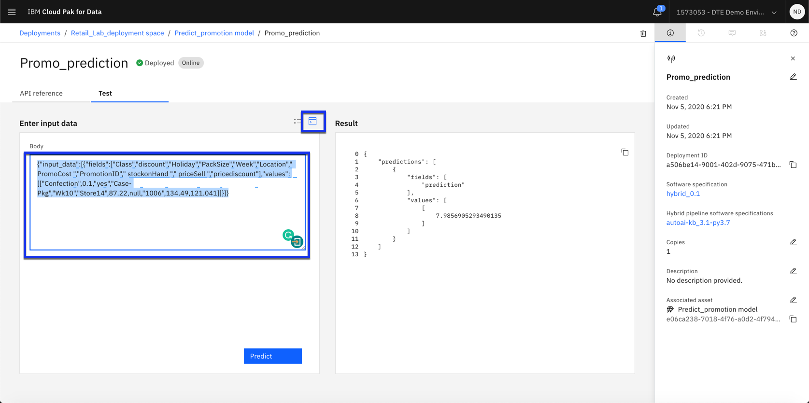

# Create AutoAI model

Watson Studio is an integrated platform designed to organize your project assets, like data sets, collaborators, models, notebooks. You are going to use Watson Studio to create a project in which you train a model with AutoAI and deploy this trained model.

### Step 1. Create a Watson Studio project
- Click Create a Project.
- Select Create an empty project.
- Name your project. If you have a Cloud Lite account, the Object Storage service you created in the previous step will be selected automatically.Otherwise, select a service from the drop-down menu and Click Create.

### Step 2. Add data to the project
- Click the Assets tab. The right-side window shows a load tab.
- Click the browse link and select the demos.csv file from the folder.
- Click Open and the file is uploaded in cloud object storage

Click demos.csv under Data assets. You can preview the first 1000 rows and all the columns for historical promotion data. Scroll on the right to look at all the columns. This is historical promotion dataset by store location
where the increase denotes the historical percentage increase in customer demand when there was any promotion. Click the Retail_lab on the top to go back to the project.

## Step 3. Create an AutoAI experiment

In this step, we will learn to use the IBM AutoAI capability to automatically select and build without coding. In the retail example we would use the increase column from demo dataset to understand the impact of promotion on customer demand.

- Click Add to project in the upper-right of the screen. In the asset type screen, click AutoAI experiment.

- Create the experiment. Give name example: *Promotion_prediction*. Click Create.Note: *If you have a Cloud Lite account, the Object Storage service you created in the previous step will be selected automatically.Otherwise, select a service from the drop-down menu*
- Click Create.
- Now we need to select the data that will be used to train the model. Click Select from project. Our project has only one file. Click the demos.csv, then click Select asset.
- Now let's select the target attribute.In the Select column to predict window Click the scroll bar. Click Increase field to identify it as the target attribute.
- Click Run Experiment. Based on the column selected AutoAI automatically selects the optimized metric and starts preparing to build the model. Note you have the option to change experiment settings
- You can see that Auto AI selects the model and does hyper parameter optimization and feature engineering on top of it.

## Step 4. Review the evaluation metrics

 In this step, we review the top 4 pipelines created and the details of the model selected. It includes the model evaluation, model information, feature transformations and feature importance. With the feature importance, we get insights on how the scoring is made.

- Click swap view to change view, The eye icon to preview data for the model. Click the rank by dropdown menu to see pipeline by different metrics
- Look at the pipeline leaderboard dashboard and Click the pipeline comparison or Experiment summary tab. You can see the most common metrics selected for regression models
- Click any Pipeline to see details of the pipeline. You see Model Evaluation Measures. Click Model Information to see a summary of the number of features
- Click the Feature Transformation to see the number of new features that were derived from historical data
- Click the Feature Importance. Here you see the important features that most likely are influencing the prediction for Increase column.

## Step 5. Deploy and test model

We look at saving deploying, testing and generating model scripts

- Click Save as model for Pipeline 8. A window opens and the provide name and description for the model.You have the option to create a notebook or save the model for deployment. By default Model is selected. Add any tags that you would like to add to the model and Click Create.Click the View in project window that shows up on the right side.

- Click Promote to Deployment Space. It takes to a screen to select deployment space. If you have not created a deployments pace then you need to create it with machine learning credentials. If you need to tag the space provide a tag and click plus icon on right. Click Promote and you will see the View deployment space window shows up on the right side.

-. You can see the promoted model on the asset tab of deployment space. Click the Deployments arrow icon on the right.

- Check the deployment type as online. The deployment named needs to be filled out. Click Create. The model is now deployed and it shows up in deployment tab.

- You can see endpoint link on the API reference tab and at the bottom have code snippets that can be pasted into the application. On the right side deployment id and other model summary is displayed.

- Click the Test tab. In the Enter input data, the input data is tabular format or in JSON format and you can input a record to get the scoring result. On the screen paste the following

{"input_data":[{"fields":["Class","discount","Holiday","PackSize","Week","Location"," PromoCost ","PromotionID"," stockonHand "," priceSell ","pricediscount"],"values":[["Confection",0.1,"yes","Case-Pkg","Wk10","Store14",87.22,null,"1006",134.49,121.041]]}]}

- Click Predict.
- We see the resulting scoring record showing the value 7.986. This means the model predicts and impact of promotion leading to an increase in demand for that class of product by 7.986 percent

- Click Retail_Lab to go back to the project

** This is end of this lab **
