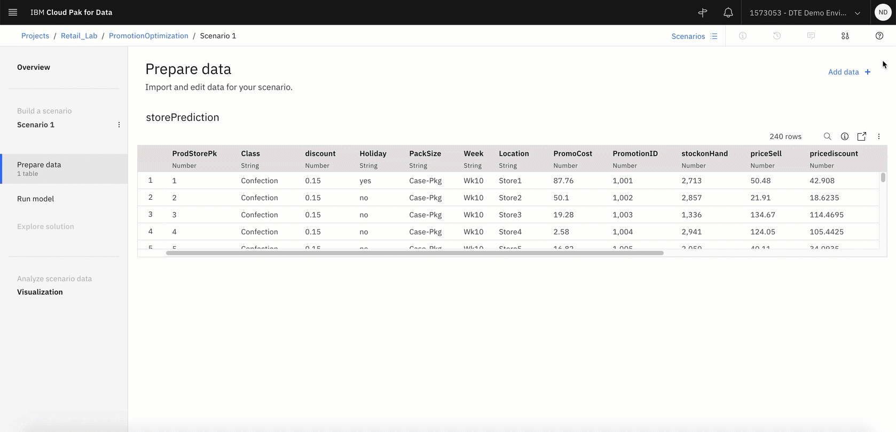
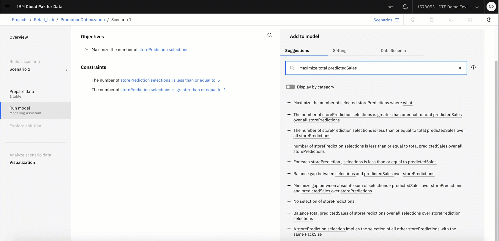
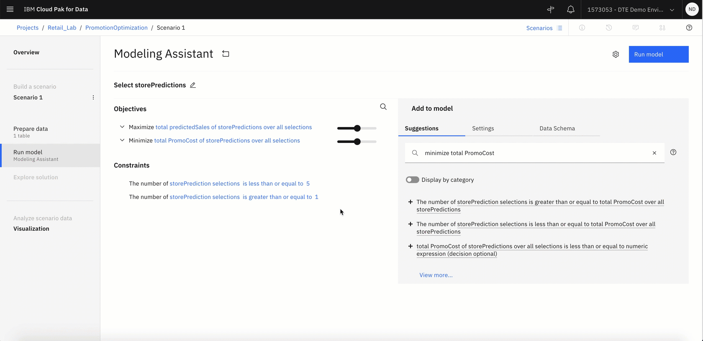
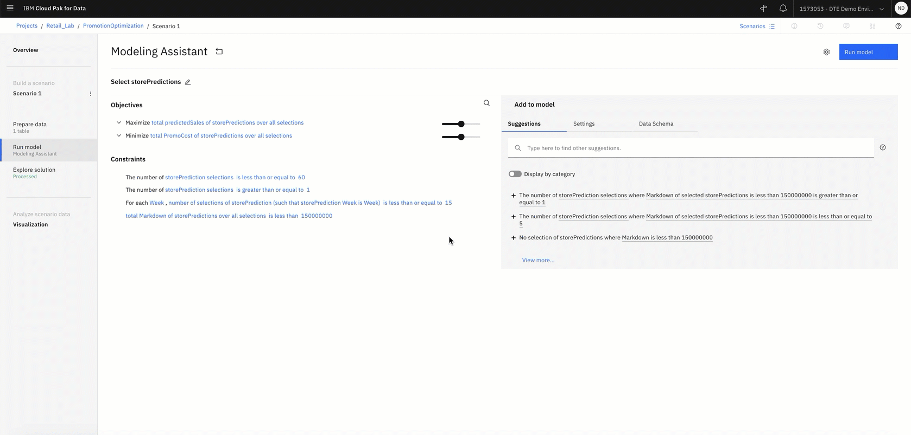

# Create Decision optimization model

 Start to develop an optimization model.

 Once we predict the increase in sales using AutoAI we will use DEcision Optimization experiment to build an optimization to select the promotions by store locations. The overall objective would be to maximize predicted sales and minimize promotion cost with budget limitations.

### Step 1. Add storePrediction data to the project

You're ready to start setting up the optimization model and configure the data set and create an initial optimization model that you can run.

- Click the Add to Project button in the top-right corner. A window with all services and you can click the Decision Optimization Experiments tile. Give it a name. For the purposes of this demo, the name *PromotionOptimization*
- Click Create.The model builder is shown, which guides you through the steps in the model creation process. You start with the Select Data step on the right side. Click the browse hyperlink and select the store_predicted file.
- Click Import to import the selected data files into the project.You’re now in the Prepare data step in the model builder. In this step, you can review and edit the imported data files.

++Input Data++
ProdStorePk	- record id
Class	- Product type
discount - discount percentage
Holiday	- identifies if promotion is for a holidays or regular promotion
PackSize - product packaging
Week - Week number
Location - Store locations
PromoCost - Cost of promoting the product class for that week
PromotionID - promotion identifier
stockonHand - Qty on hand
priceSell - Selling price of the product class
pricediscount - Discounted price of the product class
predictedIncrease - Increase or decrease in demand for promotion
predictedSales - predicted sales for product class
Markdown - Markdown cost if sold at pricediscount( predicted sales * pricediscount)

### Step 2. Define the optimization model using natural language modeling assistant
In this step, we will develop an optimization model

- In the left navigation of the model builder, click Run Model.
- In the wizard that opens, click Use Modeling Assistant. The modeling assistant has four prebuilt common templates.

  **Scheduling** - The Scheduling domain when you have tasks or activities that you need to schedule, to be done in a given order with specific start and end times.

  **Resource Assignment** -  The Resource Assignment domain when you want to assign (or match) resources (workforce, equipment, budget,...) to targets (jobs, events, places), given their respective constraints.

  **Selection & Allocation** - Selection problems are about choosing from a list of possibilities. You can use the Selection and Allocation domain when you have combined all the possible choices you want to consider in one single table.

  **Supply & Demand Planning** - This is more geared towards deciding where to source limited resources given demand that needs to be fulfilled.

To learn more about how to use the templates click [here](https://www.ibm.com/support/producthub/icpdata/docs/content/SSQNUZ_current/do/DODS_Mdl_Assist/mdl_asst_domains.html)
- For our use case we will use Selection & Allocation template. Click Selection & Allocation.
- It asks the question

  * What are the items to select from? Select storePrediction. Click Continue
  * How do you want the selection to be made? Select from: storePrediction and decide the quantity to be allocated. Uncheck box to indicate that you do not need to allocate the quantity for the investment selection since we are just interested in selection.Click Continue and then click Finish.The initial model is shown with an objective and a few preselected constraints.

- On the right side under the Suggestion section, you will see a few suggested constraints. In the Suggestion section on the right, we have populated maximize expected return percentage. It gives you a list of suggestions. Type *Maximize total predictedSales* in the suggestion box.
- Under the Objectives: Maximize the number of storePrediction selections, click on three vertical dots and click Remove
- On the Suggestion section on the right, type *minimize total PromoCost*. It gives you a list of suggestions. You can click the plus icon next to *Minimize total promoCost of storePredictions over all selections*

- Next, modify a suggested constraint. The number of storePrediction selection is less than or equal to 5. We need recommendation for 60 store, promotion combination so we will modify the constraint. Click 5 and click to make it 60.
- Now we add a constraint, On the Suggestion section on the right, we type *each week selection is less than or equal to 15* You can click the plus icon next to *For each Week, number of selections of storePredictions is less than or equal to 15*.
- We add another constraint. On the Suggestion section on the right, *total Markdown is less than 150000000* You can click the plus icon next to *total Markdown of storePredictions over all selections is less than 150000000*

- In the upper-right corner, click Run to send the model to the optimization engine. The model runs and you’re presented with the value of the objective function. In the KPI's section, you can scroll down and review the kpis table and in solution tab look at the solution . You can also explore the engine statistics and log tab

### Step 3. Create Scenario and compare solution
