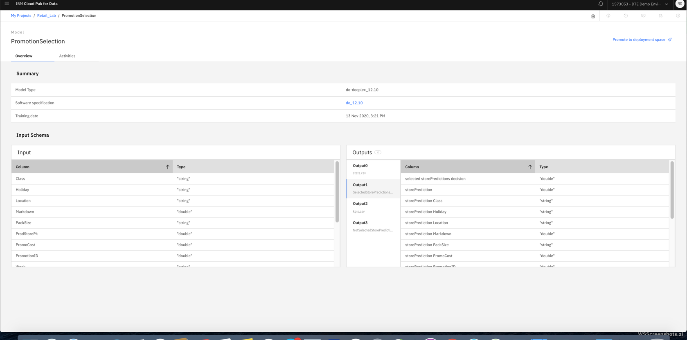
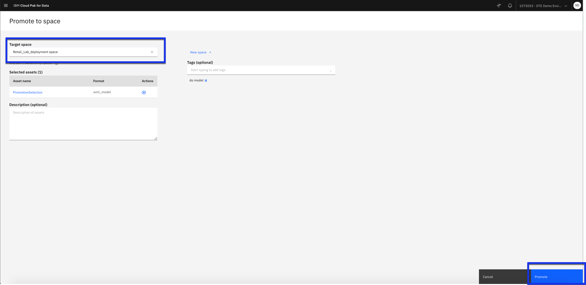
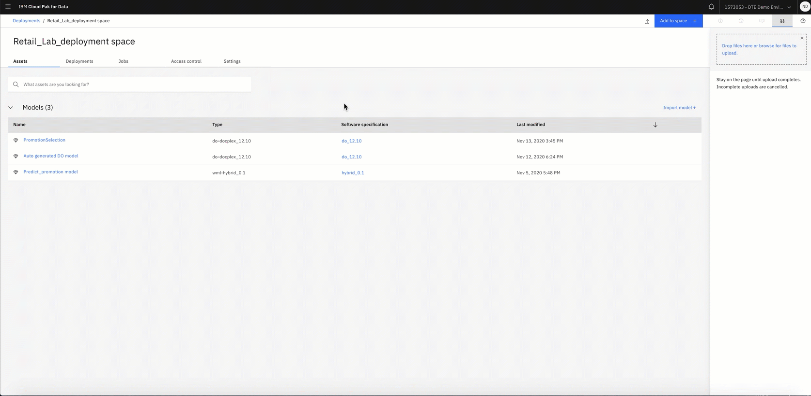
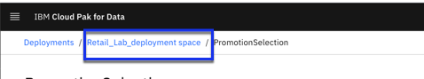

# Deploy Decision optimization model

 In this tutorial you will Save model for deployment, promote it to deployment space, create deployment and create a job with assets added to space.

### Step 1. Save and promote model for deployment

 - Click Scenario that you need to deploy. From tutorial2 we will use *PromotionSelection2* scenario and deploy it.Click on three dots and click **Save for deployment** Give it a name and description which is option for example: PromotionSelection
 - A message pops to view the model in project. Click on it and you will see the model under Watson Machine Learning section in assets tab.You can see the model type is docplex and engine is 12.10. Note that this will only use the optimization model. It does not export the data or visualization. We will give the data once we deploy the model.

 

- You can look at the input and output schema. The next thing is to promote the model to deployment space. click Promote to deployment space. This is separate space from development. So data scientist can work in Watson studio and then can promote it to separate space.

 

- Select deployment space Example: *Retail_Lab_deployment space* Click Promote.

- Click on deploy icon on right for PromotionSelection under assets tab. It will take you to a screen where it ask to give it name example:*promotionOpti* select the hardware configuration from the dropdown menu and keep the node to 1 (this is to define execution in parallel) and click Create.

You can see the deployment id generated which can be used to call from application written in C++, java or python to call this model and execute it.

### Step 2. Add data to deployment space

- Click the *Retail_Lab_deployment space* on the top left side.

- Click the **Drop files here or browse files to upload** on the right side and go to [data folder]()
